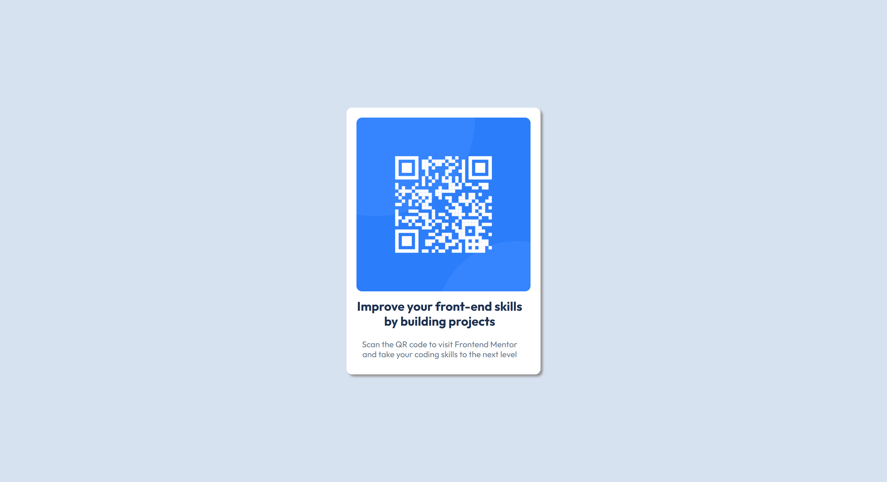

# QR code component solution

## Table of contents

- [Overview](#overview)
  - [Screenshot](#screenshot)
  - [Links](#links)
- [My process](#my-process)
  - [Built with](#built-with)
  - [What I learned](#what-i-learned)
  - [Continued development](#continued-development)
- [Author](#author)


## Overview

### Screenshot




### Links

- Solution URL: [GitHub](https://github.com/Rahulg8270/QR-Component)
- Live Site URL: [Vercel](https://qr-component-blond.vercel.app/)

## My process

### Built with

- Semantic HTML5 markup
- Flexbox
- fluid units


### What I learned

I have learned how to use the properties like max-width and min-width while making the image responsive and contained inside the container without overflowing by making it responsive for smaller screens from 300px width to larger screens 1200px and more.

Not only that I have learned sometimes it is better not to use min-width, it will be useful especially when working for smaller devices

To see how you can add code snippets, see below:

```html
<main id="qr-container">
      
      <h2>Improve your front-end skills by building projects</h2>
      <p>
        Scan the QR code to visit Frontend Mentor and take your coding skills to
        the next level
      </p>
</main>
```
```css
#qr-container {
  width: 90%;
  max-width: 350px;
  box-shadow: 4px 4px 4px rgb(149, 148, 148);
  background-color: #fff;
  border-radius: 10px;
  padding: 1.2em;
}
#qr-container img {
  width: 100%;
  max-width: 320px;
  border-radius: 10px;
}
```

### Continued development

I want to refine my UI/UX skill of picking a good typography and adding the right amount of space between the elements to separate the elements so that they are distinguishable on the page and making the user experience good.


## Author

- Portfolio - [Rahul G](https://www.crio.do/learn/portfolio/rahul-g8270/?edit=true)
- Frontend Mentor - [@Rahulg8270](https://www.frontendmentor.io/profile/Rahulg8270)
- Twitter - [@Rahulg66919](https://x.com/Rahulg66919)
- Linkedin - [/rahulganta](https://www.linkedin.com/in/rahulganta/)


